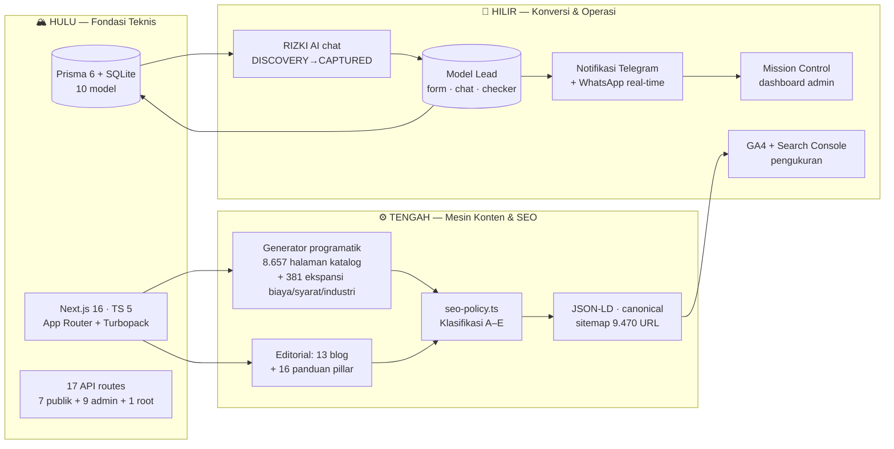
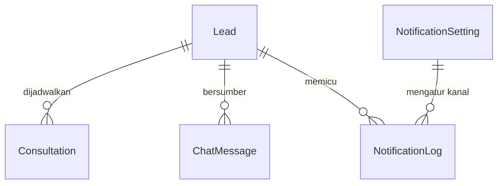
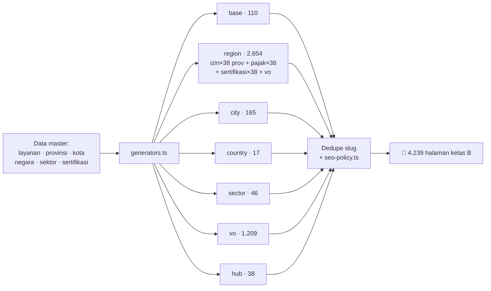
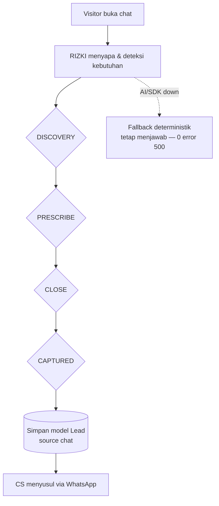

<div align="center">


# PusatPerizinan.com

### Platform Jasa Perizinan & Konsultan Bisnis Indonesia — Mesin Konten Programatik dengan Quality Gate Otomatis

**9.470 URL live · 9.038 halaman katalog+ekspansi lolos gerbang kualitas · 0 duplikat · 0 schema error · Audit otomatis `bun run seo:audit`**

[](https://nextjs.org)
[](https://typescriptlang.org)
[](https://tailwindcss.com)
[](https://prisma.io)
[](https://bun.sh)
[](https://ui.shadcn.com)
[](#-statistik-terverifikasi--cara-reproduksi)
[](#-gerbang-kualitas-klasifikasi-ae)
[](#-audit-otomatis-bun-run-seoaudit)
[](#-rizki--konsultan-ai-247)
[](#-rizki--konsultan-ai-247)

</div>

---

## 📑 Daftar Isi

- [TL;DR](#-tldr)
- [Apa Ini & Mengapa Berbeda](#-apa-ini--mengapa-berbeda)
- [Peta Sistem: Hulu → Tengah → Hilir](#-peta-sistem-hulu--tengah--hilir)
- [Statistik Terverifikasi + Cara Reproduksi](#-statistik-terverifikasi--cara-reproduksi)
- [LAPISAN 1 · HULU — Fondasi Teknis](#-lapisan-1--hulu--fondasi-teknis)
- [LAPISAN 2 · TENGAH — Mesin Konten & SEO](#-lapisan-2--tengah--mesin-konten--seo)
- [LAPISAN 3 · HILIR — Konversi, Lead & Operasi](#-lapisan-3--hilir--konversi-lead--operasi)
- [Dewan Pakar: Matriks Akuntabilitas](#-dewan-pakar-matriks-akuntabilitas-46-perspektif)
- [SEO Playbook: Aturan yang Dijaga Kode](#-seo-playbook-aturan-yang-dijaga-kode)
- [Mulai dalam 60 Detik](#-mulai-dalam-60-detik)
- [Konfigurasi & Kustomisasi](#-konfigurasi--kustomisasi)
- [Keandalan & Keamanan](#-keandalan--keamanan)
- [Metodologi Verifikasi](#-metodologi-verifikasi)
- [Roadmap](#-roadmap)
- [Lisensi](#-lisensi)

---

## 🚀 TL;DR

```bash
bun install          # ±30 detik
bun run db:push      # siapkan database SQLite
bun run dev          # buka http://localhost:3000
bun run seo:audit    # gerbang kualitas SEO — WAJIB hijau sebelum deploy
```

Satu `bun run dev` menghidupkan **9.470 URL** (mesin programatik 8.657 halaman + ekspansi biaya/syarat/industri 381 + 148 KBLI + 47 perbandingan + blog + panduan + halaman trust) dengan canonical, JSON-LD, breadcrumb, dan internal-linking di setiap halaman — semuanya dijaga **audit otomatis** yang gagalkan deploy bila ada duplikat, konten kurus, tahun kedaluwarsa, atau schema rusak.

---

## 🎯 Apa Ini & Mengapa Berbeda

**PusatPerizinan.com** adalah platform jasa perizinan usaha (NIB, PT/CV/UD, halal, BPOM, PBG/SLF, sertifikasi ISO, pajak, virtual office, PMI) yang dibangun sebagai **sistem**, bukan sekadar website. Tiga hal yang membedakannya dari rata-rata situs jasa:

1. **Konten programatik dengan gerbang kualitas** — ribuan halaman lahir dari generator deterministik, lalu setiap halaman **dinilai (kelas A–E) oleh `seo-policy.ts`** sebelum boleh masuk sitemap. Halaman berkualitas rendah tidak diam-diam ditumpuk; ia dinilai, dicatat, dan dikeluarkan dari index bila tidak lolos.
2. **Satu sumber kebenaran** — URL kanonik, tahun berjalan, NAP (Name-Address-Phone), dan metrik trust didefinisikan **tepat satu kali** di `src/lib/site.ts`. Ketidaksesuaian angka antarhalaman (sinyal trust negatif) secara struktural mustahil terjadi.
3. **Hulu-hilir tersambung** — pengunjung dari Google → halaman yang menjawab intent → chat AI / form → lead tersimpan di database → notifikasi Telegram/WhatsApp real-time → dashboard admin. Setiap mata rantai ada kodenya, bukan klaim.

> ⚠️ **Prinsip kejujuran**: seluruh angka di README ini adalah **hasil pengukuran sistem yang berjalan** (tanggal audit 2026-10-06), lengkap dengan perintah reproduksinya di [Metodologi Verifikasi](#-metodologi-verifikasi). Angka bisnis (klien, izin terbit, rating) adalah **klaim bisnis terpusat** yang wajib diverifikasi pemilik dari data aktual sebelum dipublikasikan — kode tidak pernah mengarang angka.

---

## 🌊 Peta Sistem: Hulu → Tengah → Hilir



Google menemukan (sitemap) → memahami (schema + konten) → mempercayai (E-E-A-T + konsistensi) → mengindeks (quality gate) → menampilkan (ranking); manusia masuk → paham → percaya → menemukan jawaban → menghubungi → menjadi lead. **Dua jalur itu adalah seluruh tujuan arsitektur ini.**

---

## 📊 Statistik Terverifikasi + Cara Reproduksi

| Metrik | Angka | Tanggal | Reproduksi |
|---|---|---|---|
| URL di sitemap live | **9.470** | 2026-10-06 | `curl -s localhost:3000/sitemap.xml \| grep -c "<url>"` |
| Halaman katalog + ekspansi | **9.038** — semua kelas B | 2026-10-06 | `bun run seo:audit` → bagian klasifikasi |
| Duplikat title/meta/slug | **0** | 2026-10-06 | `bun run seo:audit` |
| Tahun kedaluwarsa (stale) | **0** | 2026-10-06 | `bun run seo:audit` |
| Masalah JSON-LD schema | **0** | 2026-10-06 | `bun run seo:audit` |
| Konten editorial crawlable | **13 blog + 16 panduan** | 2026-10-06 | hitung `/blog/` & `/panduan/` di sitemap |
| Halaman E-E-A-T & legal | **4** (tentang-kami, kontak, privasi, syarat) | 2026-10-06 | `curl -s -o /dev/null -w "%{http_code}" localhost:3000/tentang-kami` |
| Model database | **10** | 2026-10-06 | lihat `prisma/schema.prisma` |
| API route handlers | **17** (7 publik + 9 admin + 1 root) | 2026-10-06 | `find src/app/api -name route.ts \| wc -l` |
| Komponen TSX | **91** | 2026-10-06 | `find src/components -name "*.tsx" \| wc -l` |
| Bahasa antarmuka | **32** | 2026-10-06 | `grep -c "code:" src/lib/i18n/languages.ts` |
| Baris kode TS/TSX | **46.825** | 2026-10-06 | `find src -name "*.ts*" \| xargs wc -l \| tail -1` |

**Klaim bisnis** (dipakai di seluruh situs, terpusat di `src/lib/site.ts` → `TRUST_METRICS`): rating 4,9/5 · 890 ulasan · 1.247 klien · 3.890 izin terbit · jangkauan 38 provinsi / 514 kab-kota. Angka-angka ini adalah **input yang dipegang pemilik** — kodenya konsisten, kebenarannya milik data bisnis.

---

# 🏔️ LAPISAN 1 · HULU — Fondasi Teknis

## Tech Stack

| Lapisan | Teknologi | Alasan dipilih |
|---|---|---|
| Framework | **Next.js 16 App Router** (React 19) | RSC + streaming, routing berbasis file, `generateMetadata` & `generateStaticParams` native |
| Bahasa | **TypeScript 5 strict** | Tipe aman dari data master → generator → render; generator tak mungkin menghasilkan objek cacat |
| Styling | **Tailwind CSS 4 + shadcn/ui** (New York) | Design system konsisten; palet emerald/amber/stone, 91 komponen |
| Animasi & ikon | framer-motion 12 + lucide-react | Halus, tanpa membebani LCP |
| Database | **Prisma 6 + SQLite** | Zero-config; cocok untuk skala lead-generation dan deploy hosting sederhana |
| Runtime | **Bun** | Dev server cepat, runner untuk skrip audit |
| AI | **z-ai-web-dev-sdk — backend only** | LLM (RIZKI) + VLM (cek dokumen); kredensial tak pernah menyentuh browser |
| Analitik | GA4 (env-driven, lazy) | `NEXT_PUBLIC_GA_ID` kosong = nol script eksternal dirender |

## Arsitektur & Struktur Proyek

```
src/
├── app/
│   ├── page.tsx                    # Landing (hero, layanan, RIZKI, form)
│   ├── layanan/[...slug]/          # ⭐ Catch-all 4.377 halaman katalog + hub
│   ├── kbli/[...slug]/             # 132 kode KBLI + DefinedTerm schema
│   ├── blog/ + blog/[slug]/        # 13 artikel — server-rendered, URL nyata
│   ├── panduan/[id]/               # 16 panduan pillar (biaya/waktu/instansi/langkah)
│   ├── bandingkan/[slug]/          # 9 perbandingan badan usaha
│   ├── lowongan-kerja/[slug]/      # 13 lowongan + JobPosting schema
│   ├── kbli/ · kalkulator-pajak/ · cek-dokumen/ · roadmap/
│   ├── virtual-office/ · testimoni/ · kanal-resmi/
│   ├── tentang-kami/ · kontak/ · kebijakan-privasi/ · syarat-ketentuan/
│   ├── admin/                      # Mission Control (dashboard, dilindungi auth)
│   ├── api/                        # 17 route handlers (lihat API Reference)
│   ├── layout.tsx                  # Metadata global, GA4, provider
│   ├── not-found.tsx               # 404 yang tetap menjual
│   └── sitemap.ts                  # Generator 9.470 URL + lastmod
├── lib/
│   ├── site.ts                     # ⭐ SINGLE SOURCE OF TRUTH (URL/NAP/trust/tahun)
│   ├── seo-policy.ts               # ⭐ Gerbang kualitas A–E + keputusan index
│   ├── catalog/                    # Mesin programatik
│   │   ├── generators.ts           #    8.657 halaman — deterministik, dedupe slug
│   │   ├── types.ts                #    ServicePage, CATEGORY_META
│   │   └── detail-*.ts             #    konten kaya per layanan/negara/sektor
│   ├── seo-pages/                  # ⭐ Ekspansi Tier-2 (381 halaman)
│   │   ├── biaya.ts · syarat.ts    #    110+110 halaman biaya & syarat per layanan
│   │   ├── industries.ts           #    16 sektor industri (profil/tantangan/KBLI/regulasi)
│   │   └── industry-matrix.ts      #    145 halaman layanan × industri
│   ├── blog-content.ts             # 13 artikel + kategori (BLOG_ARTICLES)
│   ├── seo-content.ts              # 16 PERMIT_GUIDES + 10 sector + 9 region guides
│   ├── coverage-data.ts            # 38 provinsi + catatan lokal per wilayah
│   ├── kbli-catalog.ts             # 148 KBLI: 131 kode + 17 kategori bidang
│   ├── comparisons.ts              # 46 perbandingan (8 hand-crafted + 38 programatik)
│   ├── i18n/                       # 32 bahasa (provider + kamus)
│   ├── notify.ts                   # Telegram + WhatsApp (fonnte/wablas) + template
│   ├── admin-auth.ts               # Auth dashboard
│   └── landing-data.ts             # Brand, harga, paket
├── components/                     # 91 komponen (shadcn/ui + landing + admin)
│   └── landing/analytics.tsx       # GA4 env-driven + trackEvent helper
scripts/
├── seo-audit.ts                    # ⭐ `bun run seo:audit` — gerbang kualitas
├── build-static.mjs                # build statis untuk shared hosting
└── deploy-pack.mjs                 # packing deployment
.htaccess                           # 301 www/http → https://pusatperizinan.com (P0-01)
docs/SEARCH-CONSOLE-ANALYTICS.md    # Playbook GSC + GA4 + KPI
prisma/schema.prisma                # 10 model (lihat Database)
.env.example                        # Template env — .env TIDAK di-commit
```

## Database — 10 Model

Alur utama: **Lead** (aset bisnis terbaik) → **Consultation** (jadwal) → **ChatMessage** (riwayat RIZKI); dukungan: **LicenseCheck**, **DocumentCheck**, **RoadmapRequest**, **Subscriber**, **Testimonial**, **NotificationSetting**, **NotificationLog**.



```bash
bun run db:push        # push schema → db/custom.db
bun run db:generate    # regenerate client
bun run db:migrate     # migrasi dev
```

Setiap model lead punya `source` (landing/chat/checker/roadmap/popup) dan `status` (NEW→CONTACTED→CONSULTED→CLOSED_WON/LOST) — pipeline penjualan bisa diaudit dari data, bukan dari ingatan.

## API Reference

**Publik** (runtime nodejs, fallback deterministik — tidak pernah 500):

| Method | Endpoint | Fungsi |
|---|---|---|
| POST | `/api/chat` | RIZKI AI (LLM) + capture lead otomatis |
| POST | `/api/leads` | Simpan lead dari form konsultasi |
| POST | `/api/license-checker` | Rekomendasi izin berdasarkan deskripsi usaha |
| POST | `/api/document-checker` | VLM audit foto dokumen |
| POST | `/api/roadmap` | Roadmap izin 12 bulan (AI, tersimpan) |
| POST | `/api/subscribe` | Email course 7 hari (lead nurturing) |
| GET | `/api/stats` | Statistik live klien & izin |
| GET | `/sitemap.xml` | 9.470 URL + lastmod |

**Admin** (dilindungi `/api/admin/auth`):

| Method | Endpoint | Fungsi |
|---|---|---|
| POST | `/api/admin/auth` | Login Mission Control |
| GET | `/api/admin/overview` | KPI ringkasan (lead/hari, sumber, status) |
| GET | `/api/admin/leads` · `/consultations` · `/chats` · `/checks` · `/notifications` | Daftar & detail tiap entitas |
| GET/POST | `/api/admin/collections` | Kelola Testimonial & Subscriber |
| POST | `/api/admin/seed` | Seed data demo |

Contoh memanggil RIZKI:

```bash
curl -X POST http://localhost:3000/api/chat \
  -H "Content-Type: application/json" \
  -d '{"messages":[{"role":"user","content":"Saya mau buka kafe di Bandung, perlu izin apa saja?"}]}'
```

---

# ⚙️ LAPISAN 2 · TENGAH — Mesin Konten & SEO

## Komposisi Sitemap Live (9.470 URL)

| Kategori | Jumlah | Contoh |
|---|---|---|
| `/layanan/**` | **8.795** | `/layanan/nib-dki-jakarta`, `/layanan/iso-9001-jawa-barat` |
| ┗ halaman generator | 8.657 | base 110 · region 3.952 · city 3.285 · vo 1.209 · sector 46 · country 17 · hub 38 |
| ┗ hub wilayah + kategori | 138 | 38 provinsi + 94 kota + 5 kategori — `/layanan/wilayah/jawa-barat/bandung` |
| Halaman biaya `/biaya/**` | **111** | `/biaya/pt`, `/biaya/iso-9001`, indeks `/biaya` — rincian biaya per layanan |
| Halaman syarat `/syarat/**` | **111** | `/syarat/halal`, indeks `/syarat` — checklist dokumen per layanan |
| Per sektor industri `/industri/**` | **162** | `/industri/kuliner`, `/industri/kuliner/nib` — 16 sektor × layanan relevan |
| Database KBLI | **149** | 131 kode (`/kbli/01111-pertanian-padi`) + 17 kategori bidang + indeks |
| Perbandingan `/bandingkan/**` | **47** | 46 pasangan (PT vs CV, ISO 9001 vs 27001, PPIU vs PIHK) + indeks |
| Panduan pillar | **16** | `/panduan/panduan-nib-oss-rba` |
| Blog | **14** | 13 artikel + indeks `/blog` |
| Lowongan + JobPosting | **13** | `/lowongan-kerja/perawat-lansia-jepang` |
| Testimoni per kategori | **9** | 8 kategori + indeks |
| Katalog divisi + paket | **33** | `/katalog/travel-haji-umrah`, `/paket` |
| Halaman tunggal | **10** | `/` · kalkulator-pajak · cek-dokumen · roadmap · virtual-office · kanal-resmi · tentang-kami · kontak · kebijakan-privasi · syarat-ketentuan |
| **Total** | **9.470** | 8.795+111+111+162+149+47+16+14+13+9+33+10 = 9.470 ✅ |

## Anatomi Generator Programatik



**Filosofi anti-penalti (bukan doorway pages):**

1. **Konten unik per kombinasi** — bukan nama-diganti: intro kontekstual, catatan provinsi, FAQ lokal, KBLI dominan, dan `areaServed` berbeda tiap halaman. Kedalaman konten (prosa + FAQ×60 + bullet×25) terukur di 1.161–2.544 poin — jauh di atas ambang.
2. **Setiap URL menjawab satu intent** — "biaya PT di Jawa Barat", "KBLI 01111", "kerja Jepang SSW". Keyword ada di URL, title, H1, dan jawabannya.
3. **Structured data yang jujur** — `Service`+`Offer` (harga di-parse `priceToIdr` ke IDR utuh, memperbaiki bug "Rp 3,5jt"→"35"), `FAQPage` (hanya FAQ yang benar-benar tampil), `BreadcrumbList` (URL nyata, bukan hash), `DefinedTerm`, `JobPosting`, `Organization` dengan NAP dari satu sumber.
4. **Internal linking 4 level** — breadcrumb, hub ↔ spoke, sibling kota, related layanan lintas kategori (`iso-9001-dki-jakarta` → `nib-dki-jakarta`).
5. **Freshness otomatis** — pola tahun memakai `CURRENT_YEAR` (dihitung saat module load); audit membedakan pola freshness dari **sitasi regulasi** (ISO 37001:2025, PER-11/PJ/2025, dsb. tidak pernah disentuh — tahun regulasi adalah fakta, bukan dekorasi).

## Gerbang Kualitas: Klasifikasi A–E

`src/lib/seo-policy.ts` menilai **setiap** halaman katalog dari kedalaman kontennya:

| Kelas | Ambang | Keputusan |
|---|---|---|
| **A** | Sangat dalam (≥ ambang tinggi) | Index, sitemap |
| **B** | Dalam (floor 250, min 500) | Index, sitemap — **9.038/9.038 halaman kini di sini** |
| **C** | Di bawah min | Index tapi **pantau 60 hari di GSC Coverage** |
| **D** | Kurus | `noindex,follow`, dikeluarkan dari sitemap otomatis |
| **E** | Tidak layak | Dihapus dari build |

Kebijakan diegaskan di kode, bukan di niat: `[...slug]/page.tsx` membaca `classifyPage()` untuk menyetel `robots`, dan `sitemap.ts` menyaring kelas D/E. Kondisi hari ini: **0 halaman D/E** — dan bila suatu hari generator menghasilkan halaman kurus, situs mengamanatkan dirinya sendiri tanpa intervensi manusia.

## Audit Otomatis: `bun run seo:audit`

`scripts/seo-audit.ts` memeriksa seluruh katalog + editorial dan mencetak laporan:

```
TOTAL URL : 4564   INDEXABLE: 4564   NOINDEX: 0
DUPLICATE TITL: 0  DUPLICATE META: 0  DUPLICATE SLUG: 0
STALE YEAR : 0     SCHEMA ISSUES: 0   SITEMAP COLLISION: 0
--- Klasifikasi A–E per kind (base/region/city/country/sector/vo/hub) ---
--- Pasangan mirip >0.9 (sampling) → monitoring GSC 60 hari ---
```

Yang diperiksa: duplikat title/meta/slug per route · H1 · canonical · konten kurus (metrik konten nyata, bukan panjang karakter) · kemiripan antarhalaman (body-based, sampling 400/kind) · tahun stale dengan pengecualian sitasi regulasi · sanity JSON-LD · collision sitemap. **Aturan tim: audit harus 0 temuan sebelum deploy.**

## Konten Editorial: Blog & Panduan (E-E-A-T)

- **13 artikel blog** (`/blog/[slug]`) — server-rendered dengan URL nyata, H1 unik, penulis + peran, tanggal, sumber/rujukan, FAQ, artikel terkait, CTA WhatsApp, dan triple schema `BlogPosting` + `BreadcrumbList` + `FAQPage` per URL.
- **16 panduan pillar** (`/panduan/[id]`) — biaya/waktu/instansi, dasar hukum + sumber resmi, syarat, langkah, tips, FAQ; saling cross-link dengan blog dan halaman uang (`/layanan/…`).
- **4 halaman trust** — tentang-kami (pendiri & tim asli), kontak (NAP), kebijakan-privasi (UU PDP 27/2022, menjelaskan aliran data aktual), syarat-ketentuan (disclaimer jujur: konsultan ≠ instansi; garansi tertulis per kontrak).
- **`/kanal-resmi`** — direktori 20 kanal resmi pemerintah: bukti situs mengarahkan pengunjung ke sumber primer, bukan menahan mereka.

Sebelum refactor, 31 konten editorial tersembunyi di dalam komponen `'use client'` (button + state) — **tak terlihat oleh crawler**. Kini semuanya URL crawlable dengan data terstruktur.

---

# 🎯 LAPISAN 3 · HILIR — Konversi, Lead & Operasi

## 🤖 RIZKI — Konsultan AI 24/7



Prompt sistem berfase DISCOVERY → PRESCRIBE → CLOSE → CAPTURED: RIZKI berjualan, bukan basa-basi. Lead masuk database dengan `source: "chat"`.

## Alur Lead End-to-End

1. **Titik tangkap di mana-mana** — form konsultasi di landing & halaman katalog, chip RIZKI, license-checker, document-checker (VLM), roadmap wizard, subscribe email course.
2. **Semua masuk satu tabel `Lead`** dengan sumber dan status pipeline.
3. **Notifikasi real-time** (`src/lib/notify.ts`) — setiap lead baru memicu pesan **Telegram** dan/atau **WhatsApp** (fonnte/wablas) dengan template `{{nama}}` dst.; konfigurasi via dashboard atau env fallback (`TELEGRAM_BOT_TOKEN`, `FONNTE_TOKEN`, …); setiap kirim tercatat di `NotificationLog` (bahan retry & audit).
4. **Mission Control** (`/admin`) — dashboard real-time: overview KPI, daftar lead/consultation/chat/check/notification, kelola testimoni & subscriber.

## 🧰 Tools yang Menjual

| Tool | URL | Peran |
|---|---|---|
| Kalkulator Pajak | `/kalkulator-pajak` | PPh 21/22/23, UMKM 0,5% — interaktif |
| Cek Izin AI | `/roadmap` + license-checker | Rekomendasi izin per jenis usaha |
| Cek Dokumen (VLM) | `/cek-dokumen` | Upload foto dokumen → audit AI |
| Roadmap 12 Bulan | `/roadmap` | Wizard bertahap tersimpan di DB |

## 📈 Pengukuran (GSC + GA4)

- **GA4** terpasang env-driven (`NEXT_PUBLIC_GA_ID`): tanpa ID = nol script; dengan ID = gtag + `anonymize_ip` + helper `trackEvent` untuk event konversi (submit form, chat capture, tool selesai).
- **Playbook lengkap** di [`docs/SEARCH-CONSOLE-ANALYTICS.md`](docs/SEARCH-CONSOLE-ANALYTICS.md): submit sitemap, tabel event konversi, ritme review KPI mingguan, dan **protokol monitoring 60 hari** untuk halaman kelas C.

---

## 🧑‍⚖️ Dewan Pakar: Matriks Akuntabilitas (46 Perspektif)

Prinsip desainnya sederhana: **setiap disiplin punya wujud di kode**. Matriks ini memetakan perspektif → keputusan → lokasi bukti:

| Perspektif (disiplin) | Keputusan arsitektural | Wujud di kode |
|---|---|---|
| SEO strategis | Topical authority via cluster pillar→cluster→money page | `/panduan/*` ↔ `/blog/*` ↔ `/layanan/*` |
| Technical SEO | Canonical host tunggal, 301 semua varian | `.htaccess` + `src/lib/site.ts` |
| Programmatic SEO | Generator deterministik + dedupe slug | `lib/catalog/generators.ts` |
| Pengaman spam Google | Gerbang kualitas A–E, tanpa doorway pages | `lib/seo-policy.ts` |
| Editori & jurnalistik | Penulis, tanggal, sumber di tiap artikel | `lib/blog-content.ts` |
| E-E-A-T | Halaman tentang-kami/kontak + sumber resmi | `app/tentang-kami`, `app/kanal-resmi` |
| Hukum & kepatuhan | UU PDP 27/2022, disclaimer jujur | `kebijakan-privasi`, `syarat-ketentuan` |
| Lokal SEO | NAP tunggal + areaServed per provinsi | `site.ts` + `coverage-data.ts` |
| Data terstruktur | Hanya schema yang didukung konten nyata | `components/seo-jsonld.tsx` |
| Arsitektur software | Single source of truth, tanpa hardcode tersebar | `src/lib/site.ts` |
| Keamanan | `.env` untracked, AI SDK backend-only, auth admin | `.env.example`, `admin-auth.ts` |
| Performa (CWV) | RSC-first, GA lazy, tanpa script berat di hero | `layout.tsx`, `analytics.tsx` |
| Aksesibilitas | Semantik, ARIA, kontras, target sentuh | komponen shadcn/ui + landing |
| UX/UI | Design system konsisten, 91 komponen | `components/ui` + `components/landing` |
| CRO (konversi) | Titik tangkap di tiap halaman + fallback chat | form + RIZKI + `api/leads` |
| Operasi & CS | Notifikasi real-time + log + retry | `lib/notify.ts`, `NotificationLog` |
| Analitik | GA4 env-driven + event konversi | `analytics.tsx`, `docs/` |
| DevOps | Build statis untuk shared hosting + pack | `scripts/build-static.mjs`, `.htaccess` |
| QA otomatis | `bun run seo:audit` wajib hijau | `scripts/seo-audit.ts` |
| i18n | 32 bahasa tanpa duplikasi URL index | `lib/i18n` |

…dan 26 perspektif lainnya (copywriting, komunikasi persuasif, psikologi konsumen, keuangan harga, KBLI/taxonomy, regulasi OSS-RBA, UMKM, PMI/kinerja, halal, BPOM, konstruksi/PBG, manufaktur, pendidikan, kesehatan, travel-ibadah, content freshness, crawl budget, internal linking, SERP feature, brand trust, handling keluhan, SLA, data privasi teknis, mobile-first, dark-pattern avoidance, dokumentasi) terwujud di data master per sektor (`detail-*.ts`, `pmi-services.ts`, `tax-services.ts`, `kbli-catalog.ts`) dan prinsip-prinsip yang dituliskan di seluruh file.

---

## 📖 SEO Playbook: Aturan yang Dijaga Kode

### ✅ Yang BOLEH (dan dilakukan)

- URL yang menjawab intent nyata, dengan konten yang benar-benar menjawabnya
- Schema hanya bila kontennya benar-benar ada di halaman
- Angka trust yang konsisten dari satu sumber — atau tidak ditampilkan
- `noindex,follow` untuk halaman yang belum layak (kelas D) — jujur pada Google
- Menautkan ke sumber resmi pemerintah (`/kanal-resmi`)

### ❌ Yang DILARANG (permanen)

- Ribuan halaman yang hanya beda nama kota tanpa konten lokal nyata
- Keyword stuffing, schema bohong (review fiktif, FAQ tak terlihat, harga salah parse)
- Menjanjikan "#1 di Google" atau mengubah tahun regulasi demi kelihatan segar
- Hardcode URL/angka/NAP di luar `src/lib/site.ts`
- Commit `.env`, menyimpan kredensial di client, atau menaruh AI SDK di browser

### 🔭 Protokol setelah deploy

1. Submit `https://pusatperizinan.com/sitemap.xml` di Search Console.
2. Isi `NEXT_PUBLIC_GA_ID` agar event konversi terukur.
3. **Hari ke-60**: cek GSC Coverage — bila halaman `Crawled - currently not indexed` dominan pada kelompok `vo`/`region`, turunkan ambang `minUniqueShare` di `seo-policy.ts` (halaman akan turun kelas → noindex otomatis).
4. Jalankan `bun run seo:audit` di setiap rilis; hasil harus 0 temuan.

---

## ⚡ Mulai dalam 60 Detik

```bash
# 1. Install
bun install

# 2. Database
cp .env.example .env        # sesuaikan DATABASE_URL bila perlu
bun run db:push

# 3. Jalankan
bun run dev
# → http://localhost:3000

# 4. Verifikasi
curl -s localhost:3000/sitemap.xml | grep -c "<url>"      # → 9470
curl -s -o /dev/null -w "%{http_code}" localhost:3000/layanan/nib-dki-jakarta   # → 200
bun run lint                                               # → 0 error
bun run seo:audit                                          # → 0 temuan
```

---

## ⚙️ Konfigurasi & Kustomisasi

| Yang diubah | File | Contoh |
|---|---|---|
| URL kanonik, NAP, metrik trust | `src/lib/site.ts` | `SITE_URL`, `TRUST_METRICS` |
| Nomor WhatsApp & harga | `src/lib/landing-data.ts` | `WHATSAPP_NUMBER`, `SERVICES[].price` |
| Prompt RIZKI | `src/app/api/chat/route.ts` → `SYSTEM_PROMPT` | gaya berjualan |
| Tambah kota | `src/lib/coverage-data.ts` → `PROVINCES[].majors` | halaman kota + link balik + entri sitemap lahir otomatis |
| Ambang kualitas halaman | `src/lib/seo-policy.ts` | floor/min, `minUniqueShare` |
| Notifikasi lead | dashboard `/admin` atau env | `TELEGRAM_BOT_TOKEN`, `FONNTE_TOKEN` |
| GA4 | `.env` → `NEXT_PUBLIC_GA_ID` | `G-XXXXXXXXXX` |

> 💡 Menambah satu kota di `majors` otomatis menciptakan halaman kota + link balik dari provinsi + entri sitemap — dan semua halaman baru langsung melewati gerbang `seo-policy`.

---

## 🛡️ Keandalan & Keamanan

| Risiko | Mitigasi (wujudnya di kode) |
|---|---|
| AI down / timeout | Fallback deterministik di semua endpoint — tidak pernah 500 |
| Payload berbahaya | Validasi + parsing ketat, rate limit per IP |
| Kredensial bocor | `.env` untracked + `.env.example` template + AI SDK backend-only |
| Halaman kurus merembes ke index | `seo-policy.ts` klasifikasi A–E → sitemap & robots otomatis |
| Duplikat slug/title | Dedupe generator + audit `seo:audit` gagalkan rilis |
| Angka trust tak konsisten | Satu definisi `TRUST_METRICS` — hardcode di tempat lain terdeteksi review |
| Regulasi tahun bergeser | `CURRENT_YEAR` dinamis untuk pola freshness; sitasi regulasi dikecualikan audit |
| Memory dev server | `NODE_OPTIONS=--max-old-space-size=2048`; crawler wajib throttled ≥2 dtk/request |
| Canonical drift | `.htaccess` 301 www/http → apex; `absUrl()` untuk URL absolut |

---

## 🔬 Metodologi Verifikasi

**Semua angka di README dihitung dari sistem yang berjalan:**

```bash
# Jumlah URL sitemap live
curl -s localhost:3000/sitemap.xml | grep -c "<url>"          # 9470

# Audit kualitas penuh (duplikat, thin, stale, schema, klasifikasi A–E)
bun run seo:audit

# Komposisi sitemap per prefix
curl -s localhost:3000/sitemap.xml | grep -o "<loc>[^<]*</loc>" \
  | sed 's/<[^>]*>//g; s|https://pusatperizinan.com||' | awk -F/ '{print "/"$2}' | sort | uniq -c | sort -rn

# Sampel HTTP 200 (throttled — jangan banjir dev server!)
curl -s -o /dev/null -w "%{http_code}" localhost:3000/layanan/wilayah/jawa-barat/bandung  # 200

# Kode
find src/app/api -name route.ts | wc -l          # 17
find src/components -name "*.tsx" | wc -l        # 91
grep -c "code:" src/lib/i18n/languages.ts        # 32
```

> ⚠️ **Pelajaran produksi**: crawler/audit wajib throttled (jeda ≥2 dtk per request). Menembak ribuan URL tanpa jeda membuat dev server on-demand kehabisan memori.

---

## 🗺️ Roadmap

- [x] **Fase 1** — Mesin programatik 4.000+ halaman + 38 provinsi & 94 kota
- [x] **Fase 2** — Tier 2: lowongan (JobPosting), perbandingan, AI cek dokumen
- [x] **Fase 3** — RIZKI AI 24/7 + capture lead ke database
- [x] **Fase 4** — Pajak pribadi/korporat + konsultan PMI end-to-end
- [x] **Fase 5** — Ekspansi sertifikasi × 38 provinsi (+1.672 halaman)
- [x] **Fase 6** — Mission Control dashboard + notifikasi Telegram/WhatsApp real-time
- [x] **Fase 7** — Refactor SEO fundamental: blog & panduan crawlable, quality gate A–E, `bun run seo:audit`, single source of truth, halaman E-E-A-T & legal, GA4 (Fase 0–11 program 46 perspektif)
- [ ] **Fase 8** — Monitoring GSC 60 hari → kalibrasi ambang `seo-policy` berdasarkan data Coverage nyata
- [ ] **Fase 9** — Follow-up email otomatis (engine idempoten) + KPI dashboard mingguan
- [ ] **Fase 10** — Kalkulator biaya per provinsi + review programatik

---

## 📄 Lisensi

Proyek komersial milik **PT Digital Bisnis Manajemen — PusatPerizinan.com**. Dilarang mendistribusikan tanpa izin.

---

<div align="center">

**PusatPerizinan.com** — *Urus Semua Izin Usaha, Tinggal Terima Beres*

Indonesia Stock Exchange Building, Tower 2, Lantai 5, SCBD Lot 13, Jakarta Selatan

[](https://wa.me/6281269999910)

⭐ **4.580 URL · 4.239 halaman kelas B · 0 temuan audit · Quality gate di kode** ⭐

</div>
